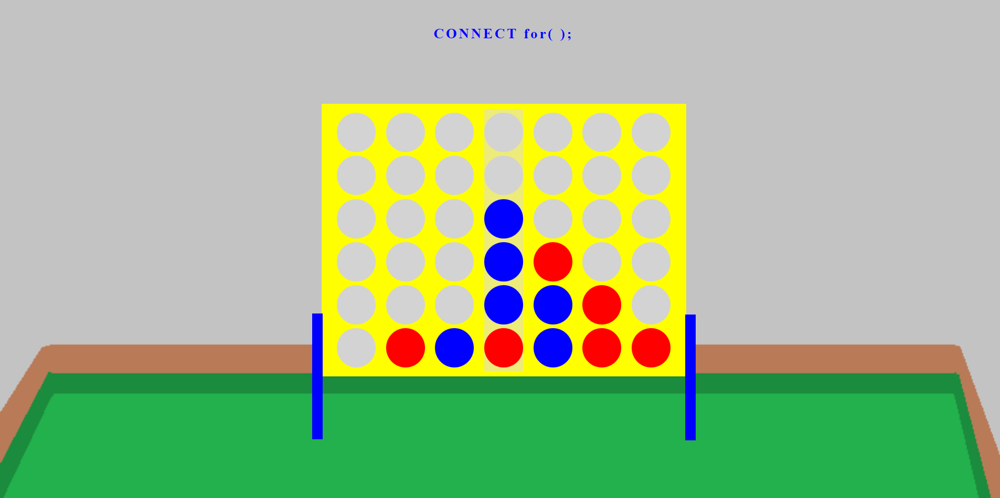
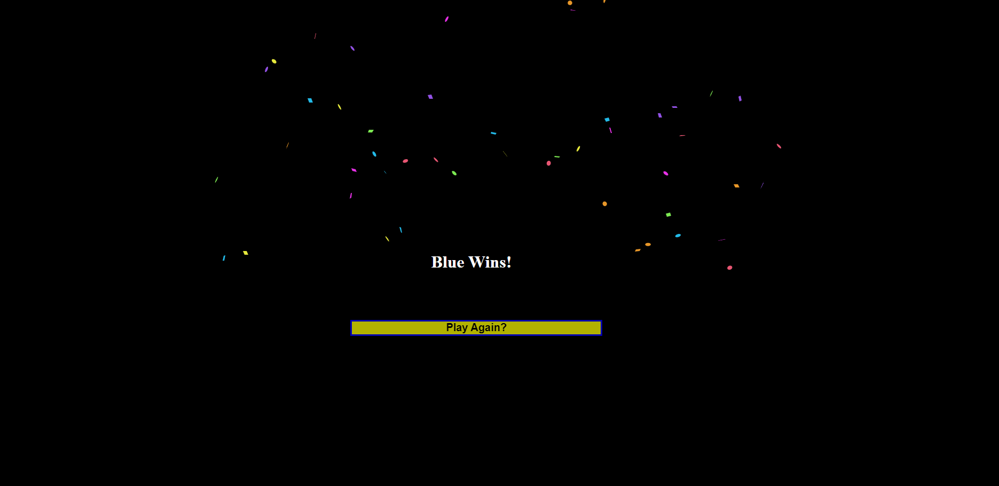

# CONNECT for();

**DISCLAIMER: The graphics of this browser game have been explicitly designed to work on a 27" widescreen monitor.  Your results may vary depending on your screen and browser window size.**

## GETTING STARTED
---
! ! ! [Click to Play Connect for();](https://extraordinary-selkie-342a48.netlify.app/) ! ! !

## SCREENSHOTS
---

## TECHNOLOGIES USED
---

- Javascript
- Cascading Style Sheets (CSS)
- HTML
- [Javascript Confetti Explosion](https://github.com/catdad/canvas-confetti)
- MS Paint
- [Whimsical.com](https://whimsical.com) (for project planning)

## NEXT STEPS
---
- Improve board and background graphics
- Create falling chip animations
- Alter "pointer" graphics to show a hand and/or a chip
- Go viral and become the net's "Most Played Connect 4 Game"
- Sell add placements in all empty screen space and make crazy $$$
- Live comfortably until old age thanks to this project

## ORIGINAL WIREFRAME PLANNING
---

[Click to open](https://whimsical.com/connect-4-wireframe-B3aZFDSYiqoyCuT1gPB7p7)

## ORIGINAL PSEUDOCODE PLANNING
---
   
### HTML - 
        Text - 
            a) I will need a header with my game title
            b) I will need text that states whether red or blue won [SHOULD BE BLANK. THE TEXT WILL BE ADDED DYNAMICALLY IN JS]
        Gameboard - 
            The board can likely be a table, just like with tic tac toe
        Buttons - 
            a) I will need seven buttons at the top of the board to place your next chip
            b) There should be a button that resets the game
### CSS - 
        Gameboard - custom styling
        Pieces - a class to color table elements
### JS - 
        Gameplay - 
            a) I should only need to assign event listeners to the buttons.  They will place a piece into the next available square on the board
        Alerts - 
            The text that announces the winner will need to be called once someone has connected four
        Code logic - 
            a) I will need to keep track of each player's moves
            b) I will need some sort of function that checks to see how many spaces in a column have been filled already, and then fill the next empty space when a button is clicked
            c) I will need to alternate between blue and red
            d) I will need to know when four pieces have been placed consecutively in a row (this should probably be calculated dynamically, as opposed to having winning combos hardcoded)
            